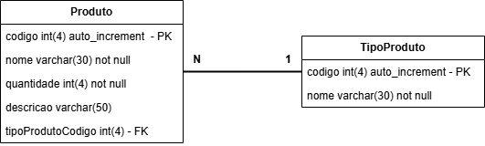

# 🐬 Capítulo 1 - Fundamentos de Banco de Dados 🐬

1. [Aula 01: Introdução ao Banco de Dados](#aula-01-introdução-ao-banco-de-dados)  
   1.1 [Estrutura de um Banco de Dados](#estrutura-de-um-banco-de-dados)  
   1.2 [MER - Modelo Entidade Relacional](#mer---modelo-entidade-relacional)  
   1.3 [DER Diagrama Entidade Realcional](#der---diagrama-entidade-relacional)  
2. [Aula 02: Comandos Básicos](#aula-02-comandos-básicos )  
   2.1 [Criando o banco de dados](#criando-o-banco-de-dados)  
   2.2 [Selecionando o banco de dados](#selecionando-o-banco-de-dados)  
   2.3 [Criando tabelas](#criando-tabelas)  
   2.4 [Inserindo registros](#inserindo-registros)  
   2.5 [Exercício](#exercício-1)  

## Aula 01: Introdução ao Banco de Dados

Um banco de dados é uma coleção de dados inter-relacionados, sempre que for possível agrupar informações que se relacionam e tratam de um mesmo assunto, posso dizer que tenho um banco de dados.

Já um sistema de gerenciamento de banco de dados é um software que possui recursos capazes de manipular as informações do banco de dados e interagir com o usuário.


>**Exemplos de SGBDs:** Oracle, SQL Server, DB2, PostgreSQL, MySQL, entre outros.

### Estrutura de um Banco de Dados

>Base de dados < Tabela < Registro < Coluna (datatype)

>Banco dados < Tabela < Linha < Campo

**Campos:** São a parte fundamental de uma base de dados.

|DADO  |TIPO   |
| ------------ | ------------ |
|Texto   |VARCHAR(n)   |
|Caractere   |CHAR(n)|
|Data |DATE   |
|Data e Hora|DATETIME |
|Inteiro|INT |
|Decimal|DECIMAL   |
|Ponto flutuante|FLOAT   |
|Ponto mais casas|DOUBLE   |
|Booleano| BOOLEAN|

### MER - Modelo Entidade Relacional
Quando desenhamos a estrutura da nossa base de dados chamamos de **MER - Modelo Entidade Relacional**, onde desenhamos o modelo do nosso banco de dados expondo todos os relacionamentos entre as tabelas.

### Exercício

Faça um MER para um hortifruti, com as tabelas: produto, funcionário e cliente.

### DER - Diagrama Entidade Relacional
É uma representação gráfica que mostra como os elementos de um sistema se relacionam entre si.



## Aula 02: Comandos Básicos

### Criando o banco de dados

```sql
CREATE DATABASE bancoteste
```

### Selecionando o banco de dados
```sql
USE bancoteste
```

### Criando tabelas
```sql
CREATE TABLE fornecedores (
   codigo int auto_increment,
   nome varchar(50) not null,
   email varchar(50) not null,
   PRIMARY KEY(codigo)
);
```

### Inserindo registros
```sql
INSERT INTO fornecedores (nome, email) VALUES ('Fiat','fiat@gmail.com');
INSERT INTO fornecedores (nome, email) VALUES ('GM','gm@live.com');
INSERT INTO fornecedores (nome, email) VALUES ('Ford', 'ford@gmail.com');
INSERT INTO fornecedores (nome, email) VALUES ('Honda', 'honda@gmail.com');
INSERT INTO fornecedores (nome, email) VALUES ('Mitsubishi', 'mitsubishi@gmail.com');
```

### Exercício
Criar uma tabela chamada carros, com os campos: id, modelo, ano, cor, placa, correceria.

Popular a tabela de carros

```sql
USE bancoteste;

CREATE TABLE carros (
   id int auto_increment,
   modelo varchar(15) not null,
   ano int not null,
   cor varchar(15) not null,
   placa varchar(8),
   carroceria varchar(10),
   idFornecedor int,
   PRIMARY KEY(id),
   FOREIGN KEY(idFornecedor) REFERENCES fornecedores(codigo)
);

INSERT INTO carros ( modelo, ano, cor, placa, carroceria, idFornecedor ) VALUES ('Mobi', 2025, 'Preto','', 'Hatch', 1);
INSERT INTO carros ( modelo, ano, cor, placa, carroceria, idFornecedor ) VALUES ('Punto', 2012, 'Cinza', '', 'Hatch', 1);
INSERT INTO carros ( modelo, ano, cor, placa, carroceria, idFornecedor ) VALUES ('Strada', 2006, 'Preto', '', 'Utilitário', 1);
INSERT INTO carros ( modelo, ano, cor, placa, carroceria, idFornecedor ) VALUES ('Onix',2023, 'Branco', '', 'Hatch', 2 );
INSERT INTO carros ( modelo, ano, cor, placa, carroceria, idFornecedor ) VALUES ('Cruze', 2022, 'Azul', '', 'Sedan', 2);
INSERT INTO carros ( modelo, ano, cor, placa, carroceria, idFornecedor ) VALUES ('Camaro', 2018, 'Amarelo', '', 'Sedan', 2);
INSERT INTO carros ( modelo, ano, cor, placa, carroceria, idFornecedor ) VALUES ('Fiesta', 2007, 'Azul', '', 'Sedan', 3);
INSERT INTO carros ( modelo, ano, cor, placa, carroceria, idFornecedor ) VALUES ('Mustang', 2024, 'Amarelo', '','Sedan', 3);
INSERT INTO carros ( modelo, ano, cor, placa, carroceria, idFornecedor ) VALUES ('Ka', 2007, 'Branco', '','Sedan', 3);
INSERT INTO carros ( modelo, ano, cor, placa, carroceria, idFornecedor ) VALUES ('City', 2022, 'Cinza', '','Sedan', 4);
INSERT INTO carros ( modelo, ano, cor, placa, carroceria, idFornecedor ) VALUES ('Civic', 2019, 'Preto', '', 'Sedan', 4);
INSERT INTO carros ( modelo, ano, cor, placa, carroceria, idFornecedor ) VALUES ('HR-V', 2019, 'Preto', '', 'SUV', 4);
INSERT INTO carros ( modelo, ano, cor, placa, carroceria, idFornecedor ) VALUES ('Lancer', 2006, 'Azul', '', 'Sedan', 5);
INSERT INTO carros ( modelo, ano, cor, placa, carroceria, idFornecedor ) VALUES ('Eclipse', 1995, 'Preto', '', 'Hatch', 5);
INSERT INTO carros ( modelo, ano, cor, placa, carroceria, idFornecedor ) VALUES ('Lancer', 2006, 'Azul', '', 'Sedan', 5);
INSERT INTO carros ( modelo, ano, cor, placa, carroceria, idFornecedor ) VALUES ('3000GT', 1993, 'Vermelho', '', 'Hatch', 5);
```

### Listando os registros

```sql
SELECT * FROM carros
```
#### Ordenando a consulta

##### Ordem crescente
```sql
SELECT * FROM carros ORDER BY modelo ASC
```

##### Ordem decrescente
```sql
SELECT * FROM carros ORDER BY modelo DESC
```


